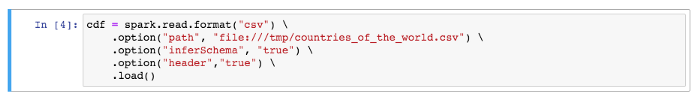
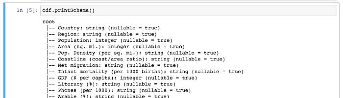
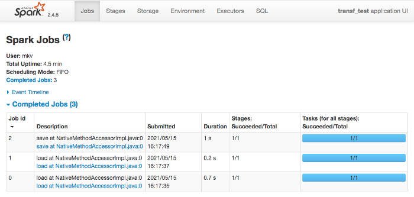
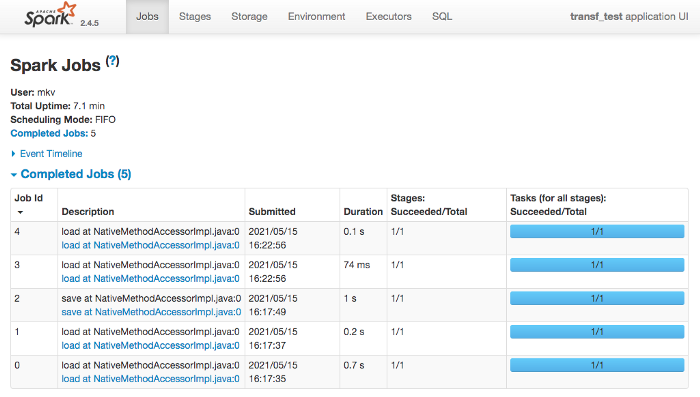
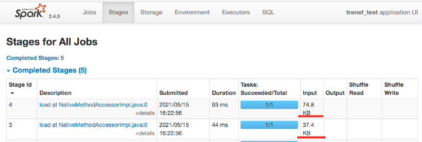
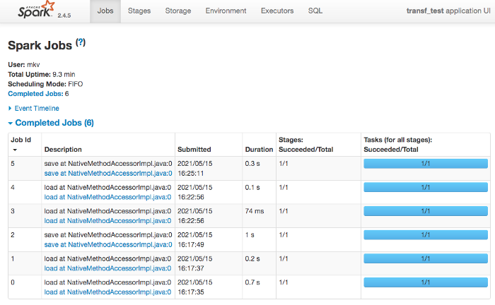
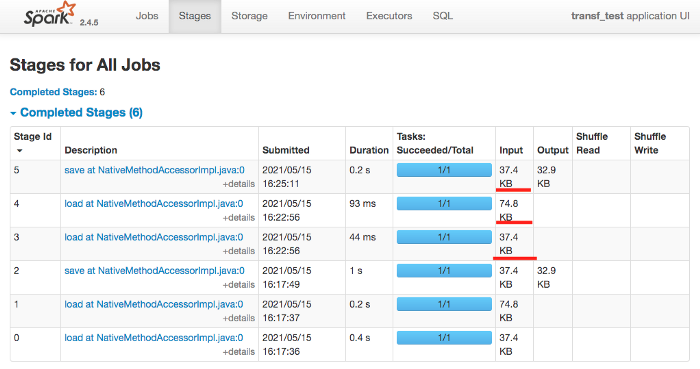
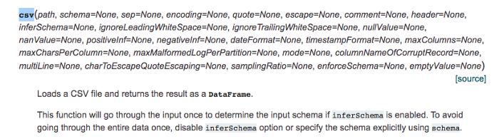

# Why NOT to use CSV with Apache Spark

I heard this once again recently:

    “CSV is a popular data storage format natively supported by Apache Spark…”

Well, “popular” — yes, “natively supported” — yes, but…, “data storage” — NO. 
Phrases like this might not only confuse people, but lead to significant time 
(and storage) inefficiencies. Let us dive in.

In this article I will talk about bulk read (which is `.load()` method of Apache Spark) 
within Structured API and `pyspark` implementation (while I doubt is works differently 
in Scala/Java bindings).

So let’s go, some common things first:

* spark uses “**lazy evaluation**” meaning `transformations` are only computed when an action requires a result to be returned to the driver program
* `.load()` is transformation so one should not expect any **significant** disk activity during `.load()` execution (significant is important, more on that later)
* **real** data load (meaning disk read activity) happens when we execute `.save()` or any other action

Sound good so far, right?

    “…practice as the criterion of truth…”

Now what happens in practice (I pasted Jupyter notebook fragments for simplicity)

STEP 1. Execute simple CSV read transformation

STEP 2. Print resulting dataframe schema with `.printSchema()`

STEP 3. Save dataframe to file (format does not matter at the moment — let it be CSV again)

Nothing extraordinary so far, file is small and it is hard to notice delay in execution on step 1 (during `.load()`). Well, there is Spark GUI to help us, here is what is shows for our small app:

Now “`magic`” starts… We have 3 jobs and this is strange: `job` usually corresponds to `action`, we had one action (`.save()`) so we expect to have one job. Strange, isn’t it? To eliminate magic let us do it again step-by-step and watch Spark GUI after each step.

Re-execute step 1, here is Spark GUI:

Now there might be no doubts —there are two new jobs (with IDs 3 and 4) without any actions in our code, so these should be results of our `.load()` transformation. Let us dig in and see disk I/O metrics of those jobs:

Interesting — file gets read three times already (file size is 37KB), what a transformation we have…

Let’s continue with our “step by step” — re-execute `.printSchema()`: got no new jobs in Spark WEB UI (which is quite natural).

Re-execute `.save()`:

One more job — as expected: there was `action`, so we got another `job`. What about disk I/O metrics:

Aha, one more “read” — we had read file 4 times already, nice, isn’t it? Such a simple “pipeline” — load, save — led to such inefficient disk I/O.

How do you like such “**data storage**” format? — me not really…

Is it just CSV or maybe I am having general Spark configuration problems? Let’s find out — why not to repeat same steps for a another file format, e.g. ORC (also natively supported by Apache Spark).

I will not bother you with screenshots and steps (steps are the same, only difference is that I load the same data from ORC file) — just results:

* no jobs after `.load()` transformation (step 1)
* got schema and no jobs after `.printSchema()` (step 2)
* single job and single file read after `.save()` (step 3)

So — yes, previous strange behavior was because of CSV, ORC format behave as expected.

And that leads us to the point I wanted to make in the article:

    Never store data you plan to process with Apache Spark in CSV format. 
    It is OK to use CSV as a transport format (e.g. during export or import 
    activities where this might be requirement), for storage use 
    ORC or Parquet file formats.

I will write another article about the Parquet and ORC, for now from my experience I can say they are on par (performance and storage wise).

# Small disclaimer and explanations

Experienced Spark developers already saw some “inconsistencies” in what I said above… Let me explain where I “crossed the corners” a bit to better express the point. Explanations below do not change the point though, they are necessary to build “better trust” in what was said above.

## Schema inference

Schema inference is not free in Spark:

It is expected to go through file data **once** when one uses schema inference (`.option(“inferSchema”,”true”)`). But why had I got file data read **twice** (see screenshots above)?

And how did Spark manage to get schema from ORC file without any jobs? This is example of “good magic” in Spark…

Is schema inference important? — Yes, you might be sure you can e.g. `.sum()` the column values in case of schema inference and CSV, if data are messy Spark will default to `StringType` and will not allow you to sum them up… It is important but **very** expensive.

I spent some extra time and repeated steps 1–3 for CSV file without schema inference — file was read just twice. Why? — see below.

## File size impact

My file was relatively small (37KB), that explains why on step 1 (`.load()`) it got read once — this is just one first block… For bigger files — and I tested this as well — behavior is the same: without schema inference `.load()` creates a job to read just first data block of the file.

My guess that this is necessary to find out the number of columns in the dataframe being constructed by `.load()`.

## End of Investigation

These final notes **conclude** my short **CSV inefficiency** investigation, stay tuned — more articles like this will follow: input and output is important part of Apache Spark framework and very time consuming operation in everyday life of any Data Engineer. **I/O should be done right!**

