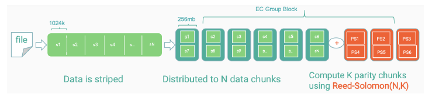
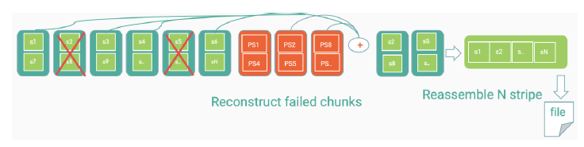
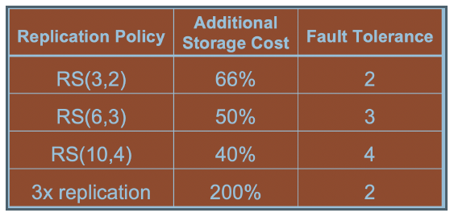

# HDFS Erasure Coding 

Появилось относительно недавно - Hadoop 3.2.1 (стоит проверить поточнее).

## Преамбула

Как все началось - после установки нового кластера в кластер менеджере вылезало сообщение об угрожающей настройке Erasure Codeing с предложением изменить конфигурацию. Полез смотреть - предлагалось изменить политику или добавить узлов. Последнее было невозможно, стал разбираться с политиками и испугался: вдруг я поменяю политику и что-то потеряю (или потенциально повышу риск)? Полез разбираться, решил краткие выводы записать, пока не забыл.

## Идея 

Идея проста: вместо дорогой репликации использовать подход RAID - для каждого блока данных файла (здесь они его назвают `cell`) рассчитываем и храним блоки с контрольными суммами (один или несколько блоков). Тогда потеря одного или нескольких блоков не приведет к потере файла.

Самый простой способ - `XOR`: для трех (например) блоков храним их XOR в виде отдельного блока. Тогда потеря любого одного блока позволит нам тем не менее прочитать исходную информацию (=восстановить потерянный блок). Проблема XOR - можем потерять не более одного блока.

Более сложный алгоритм - алгоритм `Reed-Solomon (RS)`. Не углубляясь в подробности, он позволяет для `K` блоков данных рассчитать `M` блоков четности так, чтобы можно было избежать потерь данных при потере любых `M` блоков. Именно он в настоящее время используется в HDFS.

Как это выглядит:

Потеря дисков и восстановление

Теоретически (наверное) возможно множество вариантов (конфигураций) реализации EC схем, на практике (в Hadoop) их не так много

Здесь:

* первая цифра: сколько блоков используется для расчета контрольных сумм
* вторая цифра: сколько блоков контрольных сумм будет создано
* `RS` в начале: это т.н. "кодек" (в данном случае и пока только Reed-Solomon)

## Hadoop HDFS

При использовании EC нет необходимости в репликации (точнее - ее нет и быть не может, фактор репликации для EC файлов всегда 1 и не может быть изменен). То есть мы либо используем репликацию, либо EC.

На практике мы должны явно задать т.н. "политику" для файла или директории (при его создании), т.е. без явных действий никаких EC файлов и директорий не создастся.

В конфигурации можно задать политику по умолчанию - она будет использоваться в случаях, когда политика явно не задана (можно сказать setPolicy и не указать политику - будет использована политика по умолчанию).

Вообще реалиация EC повлекла за собой определенные изменения (см. документы в ссылках ниже), пока в нашем кластере мы ее не используем.

## Дополнительная информация

Ссылки

* [от первоисточника](https://hadoop.apache.org/docs/r3.2.1/hadoop-project-dist/hadoop-hdfs/HDFSErasureCoding.html)
* [русский вариант от Аренадата](https://docs.arenadata.io/adh/administration/hdfs/ErasureCoding.html)
* [интересная статья про эффективность](https://hal.inria.fr/hal-02263116/document)
* [PDF с картинками которые я использовал](https://zenodo.org/record/3550780/files/Report_Nazerke_Seidan.pdf)
